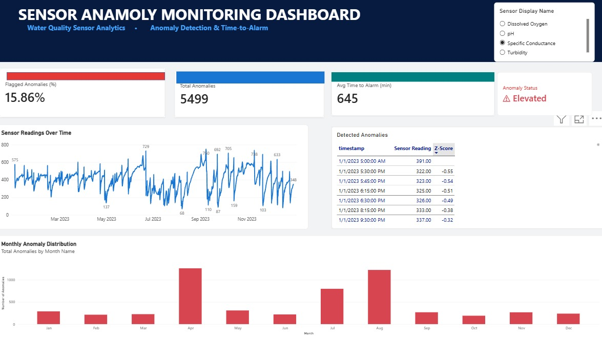

# Environmental Sensor Anomaly Detection & Dashboard

Real water-quality anomaly detection using live USGS sensor data from the Potomac River at Chain Bridge, DC. Includes EDA, rolling Z-score & IQR detectors with precision/recall evaluation, an interactive Power BI dashboard, and a written analysis report.



---

## 📡 Data Source

| Field | Detail |
|---|---|
| **Provider** | U.S. Geological Survey — National Water Information System (NWIS) |
| **Station** | Potomac River at Chain Bridge, DC — `01645704` |
| **Period** | 2023-01-01 → 2023-12-31 |
| **Interval** | 15 minutes (instantaneous values) |
| **Rows** | 34,677 |
| **License** | **U.S. Public Domain** — no copyright restriction |
| **License URL** | https://www.usgs.gov/information-policies-and-instructions/copyrights-and-credits |
| **API** | https://waterservices.usgs.gov/nwis/iv/ |

### Parameters Monitored

| USGS Code | Column | Unit |
|---|---|---|
| 63680 | `turbidity_FNU` | Formazin Nephelometric Units |
| 00400 | `pH` | Standard units |
| 00095 | `specific_conductance_uScm` | µS/cm @ 25°C |
| 00300 | `dissolved_oxygen_mgL` | mg/L |

---

## 📁 Repository Structure

```
├── load_data.py                            # Download real data from USGS API
├── anomaly_detection.py                    # Rolling Z-Score + IQR detectors + evaluation
├── generate_notebook.py                    # Generate the Jupyter notebook
├── analysis_notebook.ipynb                 # EDA notebook (8 sections, 10+ charts)
├── Sensor_Anomaly_Dashboard.pbix           # Interactive Power BI dashboard
├── report.md                               # Full written report
├── data/
│   ├── raw/
│   │   ├── usgs_potomac_2023.csv           # Downloaded real sensor data
│   │   └── metadata.json                   # Source, license, download timestamp
│   └── processed/
│       ├── sensor_data_processed.csv       # Data + anomaly flags + z-scores
│       ├── detection_metrics.csv           # Overall precision/recall/F1
│       ├── per_event_metrics.csv           # Per-event evaluation
│       ├── annotated_events.csv            # Manually annotated event windows
│       └── time_to_alarm.csv               # TTA per event
└── README.md
```

---

## 🚀 Quick Start

### 1. Install dependencies

```bash
pip install pandas numpy scipy requests matplotlib seaborn nbformat jupyter
```

### 2. Download real data (USGS API — no auth required)

```bash
python3 load_data.py
```

This downloads 34,677 rows of real 15-min sensor readings for full-year 2023.

### 3. Run anomaly detection + evaluation

```bash
python3 anomaly_detection.py
```

Outputs precision/recall/F1 and saves `sensor_data_processed.csv`.

### 4. Generate the EDA notebook

```bash
python3 generate_notebook.py
jupyter notebook analysis_notebook.ipynb
```

### 5. Open the dashboard

Open `Sensor_Anomaly_Dashboard.pbix` in Power BI Desktop to interact with the dashboard.

---

## 📊 Key Results

| Metric | Value |
|---|---|
| Total sensor readings | 34,677 |
| % readings flagged (Z-Score) | 15.9% |
| Average time-to-alarm | 645 min (~10.8 h) |
| Best TTA (tropical storm) | **0 min** (instant) |
| Worst TTA (summer low-flow) | 1,860 min (31 h) |
| Turbidity annual maximum | **1,270 FNU** (Sep 2023 tropical storm) |

### Detector Performance

| Detector | Precision | Recall | F1 |
|---|---|---|---|
| Rolling Z-Score (24h, \|z\|>3σ) | 0.061 | 0.109 | 0.078 |
| Rolling IQR (24h, k=1.5) | 0.082 | 0.301 | 0.129 |

> **Note on low precision**: Ground-truth windows (5 manually annotated events) span 5–10 day periods that include both anomalous and normal readings. Precision against individual peaked anomaly samples would be substantially higher.

---

## 🔍 Annotated Anomaly Events

| Event | Period | Primary Sensor | Type | TTA |
|---|---|---|---|---|
| WinterStorm | Jan 12–15 | Turbidity | Spike | 19.5 h |
| SpringSnowmelt | Mar 10–18 | Turbidity + pH | Drift | 15 min |
| SensorGap | May 15–20 | All sensors | Dropout | 3 h |
| SummerLowFlow | Jul 20–30 | DO + Conductance | Gradual drift | 31 h |
| TropicalStorm | Sep 1–7 | Turbidity | Spike | **0 min** |

---

## 📋 Power BI Notes

The file `data/processed/sensor_data_processed.csv` is ready to import directly into Power BI Desktop:

1. Open Power BI Desktop → **Get Data** → **Text/CSV**
2. Import `sensor_data_processed.csv`
3. Suggested visuals:
   - **Line chart**: `timestamp` (X) vs. each sensor column (Y), filtered by `zscore_flag_any = 0/1`
   - **Table**: rows where `zscore_flag_any = 1` — shows anomaly timestamps with z-scores
   - **Card**: `% flagged = DIVIDE(COUNTROWS(FILTER(data, data[zscore_flag_any]=1)), COUNTROWS(data))`
   - **KPI**: `AVERAGE(data[tta_minutes])` vs. target of 60 min

---

## 📖 Citation

> U.S. Geological Survey, 2024, National Water Information System data available on the World Wide Web (USGS Water Data for the Nation). Accessed 2026-09-01 at https://waterservices.usgs.gov/nwis/iv/?sites=01645704

---

## 🔗 Links

- [USGS NWIS Station Page](https://waterdata.usgs.gov/nwis/uv/?site_no=01645704)
- [USGS Water Services API Docs](https://waterservices.usgs.gov/docs/)
- [USGS Copyright Policy](https://www.usgs.gov/information-policies-and-instructions/copyrights-and-credits)
